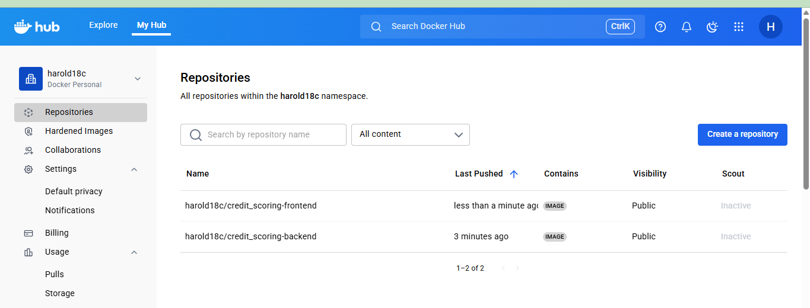
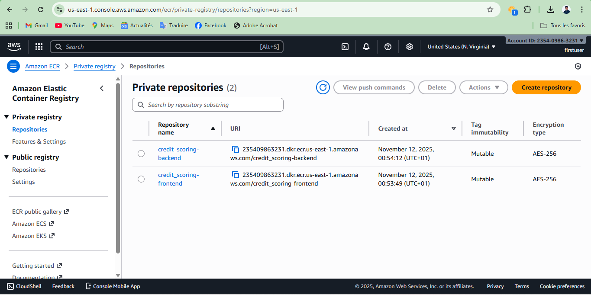

# Credit-Scoring-in-an-African-context
Access to credit is one of the key drivers of economic development, whether it is used to finance a business, a personal project, or an urgent need. But before granting a loan, a crucial question arises: will the client be able to repay it?

This is the central challenge of credit scoring, a task at the heart of modern banking systems. Thanks to data and artificial intelligence, financial institutions can now assess the risk of default with greater accuracy and fairness.

In Africa, where a large part of the population remains underbanked, developing efficient and locally adapted scoring models can promote sustainable financial inclusion.

To address this challenge, I'm designing a model that **predicts the risk of default** based on the credit histories of clients from a financial institution.

---

# 💡Solution

To tackle the challenge of credit risk assessment, a **stacking ensemble machine learning approach** was implemented. The solution combines the strengths of multiple powerful base models — **XGBoost**, **LightGBM**, and **Random Forest** — to capture different patterns and interactions in the credit history data. These base models generate predictions that are then used as inputs to a **meta-model**, in this case an **SGDClassifier**, which learns to optimally combine them and produce a final risk score.

The hyperparameters of both the base models and the meta-model were fine-tuned using a combination of **Bayesian optimization** and **GridSearchCV**, ensuring robust performance while controlling for overfitting. Special care was taken to address **class imbalance**, which is common in credit datasets, through appropriate weighting strategies.

The resulting model achieves a **ROC AUC of 0.701** on the validation set, demonstrating a good ability to discriminate between clients who are likely to default and those who are not. This solution can be used by financial institutions to make more informed lending decisions, improving both credit accessibility and risk management, and ultimately supporting financial inclusion in underbanked regions.

# Docker Hub

# AWS ECR
